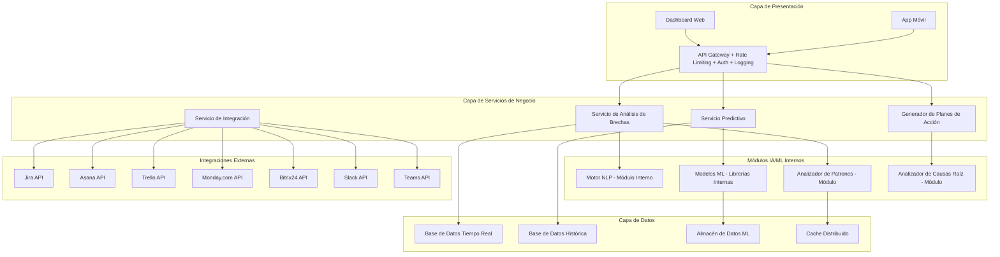

# Documento de Diseño

## Visión General

La Herramienta de Análisis de Brechas de Proyectos Impulsada por IA es una solución SaaS especializada que funciona como una capa de análisis horizontal sobre herramientas existentes de gestión de proyectos. El sistema utiliza algoritmos de machine learning y procesamiento de lenguaje natural para automatizar el análisis de brechas, predicción de problemas y generación de planes de acción.

### Principios de Diseño

1. **Arquitectura de Capa Horizontal**: Diseñado para complementar, no reemplazar herramientas existentes
2. **IA Especializada**: Enfoque específico en análisis de brechas vs funcionalidades generales de gestión
3. **Predicción Proactiva**: Anticipar problemas 72+ horas antes de que ocurran
4. **Automatización Inteligente**: Reducir trabajo manual en 70%+ mediante IA
5. **Integración Sin Fricción**: Conectividad plug-and-play con herramientas populares

## Stack Tecnológico

### Backend (Servicios de Negocio y Microservicios)

- **Lenguaje principal**: TypeScript
- **Package manager**: PNPM (más rápido y eficiente que npm)
- **Framework principal**: NestJS (ideal para microservicios escalables con decoradores y DI)
- **API Gateway**: NGINX con módulos gratuitos de rate limiting y auth
- **Base de datos principal**: PostgreSQL (relacional, robusta para datos estructurados)
- **ORM**: Prisma (type-safe, excelente con TypeScript)
- **Validación**: class-validator + class-transformer

### Capa de IA/ML

- **Lenguaje para IA**: Python
- **Frameworks ML**:
  - scikit-learn, XGBoost (modelos estructurados para predicciones)
  - Transformers de HuggingFace (para NLP y procesamiento de texto libre)
  - spaCy (extracción de entidades y análisis sintáctico)
- **Manejo de pipelines**: MLflow (open source) para tracking de experimentos y modelos
- **Interfaz NestJS-Python**: FastAPI + gRPC para comunicación de baja latencia
- **Modelos LLM gratuitos**: Ollama con Llama 3.1 o Mistral (local/gratuito) para generación de planes de acción

### Frontend (Capa de Presentación)

- **Package manager**: PNPM (consistente con el backend)
- **Framework web**: Next.js 14 con App Router
- **Librería de UI**: Tailwind CSS + ShadCN/UI
- **Gráficos y visualizaciones**: Recharts para dashboards interactivos
- **Estado global**: Zustand (más ligero que Redux para este caso)
- **Autenticación cliente**: NextAuth.js + OAuth
- **Consultas de datos**: TanStack Query para cache y sincronización

### Integraciones Externas

- **Conectores directos**: SDKs oficiales (Jira, Asana, Trello, Monday.com, Bitrix24)
- **Gestión de webhooks**: NestJS + Bull Queue para procesamiento asíncrono
- **Sincronización**: Polling programado + webhooks bidireccionales
- **Transformación de datos**: Mappers específicos por herramienta

### Cache y Comunicación Interna

- **Colas de tareas**: BullMQ (basado en Redis) para procesamiento asíncrono
- **Cache distribuido**: Redis para sesiones y datos frecuentes
- **Pub/Sub microservicios**: Redis Streams para comunicación entre servicios
- **Message broker**: NATS para eventos críticos

### Infraestructura y DevOps

- **Contenedores**: Docker con multi-stage builds
- **Orquestación**: Kubernetes (minikube local o k3s para desarrollo)
- **CI/CD**: GitHub Actions (gratuito para repos públicos)
- **Monitorización**:
  - Logs: ELK Stack (Elasticsearch, Logstash, Kibana) - todas open source
  - Métricas: Prometheus + Grafana (ambos open source)
  - Errores: Sentry (plan gratuito hasta 5k errores/mes)
  - APM: Jaeger (open source) para distributed tracing

### Seguridad

- **Autenticación/Autorización**: Keycloak (open source) para SSO empresarial
- **RBAC**: Implementado en NestJS con guards y decoradores
- **Cifrado**: TLS 1.3 + AES-256 para datos en reposo
- **Secrets management**: HashiCorp Vault (open source) o variables de entorno seguras
- **Auditoría**: Logs estructurados con correlación de eventos

### Base de Datos y Almacenamiento

- **Principal**: PostgreSQL (open source) con particionamiento por tenant
- **Time-series**: InfluxDB (open source) para métricas de rendimiento
- **Documentos**: MongoDB Community (gratuito) para datos no estructurados
- **Files**: MinIO (open source, compatible con S3) para almacenamiento de archivos
- **Search**: Elasticsearch (open source) para búsqueda full-text

### Hosting y Despliegue (Opciones Gratuitas)

- **Package manager**: PNPM en todos los entornos (desarrollo, CI/CD, producción)
- **Desarrollo**: Docker Compose local + minikube
- **Staging/Producción pequeña**:
  - Railway (plan gratuito con limitaciones, soporta PNPM)
  - Render (plan gratuito para servicios web, soporta PNPM)
  - Fly.io (allowance gratuito mensual, soporta PNPM)
  - DigitalOcean (créditos iniciales gratuitos)
- **Base de datos gratuita**:
  - PostgreSQL en Supabase (plan gratuito)
  - MongoDB Atlas (plan gratuito 512MB)
- **Storage gratuito**:
  - Cloudflare R2 (10GB gratuitos)
  - Backblaze B2 (10GB gratuitos)

## Código Limpio y Escalabilidad

### Principios y Convenciones

**Principios SOLID aplicados:**

- **SRP**: Cada clase/función tiene una sola responsabilidad
- **DRY**: Helpers genéricos reutilizables para lógica común
- **OCP**: Interfaces extensibles sin modificar código existente
- **DIP**: Inyección de dependencias en NestJS

### Estructura de Proyecto Recomendada

```
src/
├── common/                 # Código compartido entre módulos
│   ├── decorators/        # Decoradores personalizados
│   ├── filters/           # Exception filters
│   ├── guards/            # Guards de autenticación/autorización
│   ├── helpers/           # Funciones utilitarias reutilizables
│   ├── interceptors/      # Interceptors para logging, transformación
│   ├── pipes/             # Pipes de validación personalizados
│   └── index.ts           # Barrel export
├── types/                 # Tipos e interfaces TypeScript
│   ├── api/              # Tipos para APIs externas
│   ├── database/         # Tipos de entidades de BD
│   ├── services/         # Tipos para servicios
│   └── index.ts          # Barrel export
├── modules/              # Módulos de negocio
│   ├── gap-analysis/     # Módulo de análisis de brechas
│   │   ├── dto/          # Data Transfer Objects
│   │   ├── entities/     # Entidades de base de datos
│   │   ├── services/     # Lógica de negocio
│   │   ├── controllers/  # Controladores REST
│   │   └── index.ts      # Barrel export
│   └── predictions/      # Módulo predictivo
└── config/               # Configuraciones
    ├── database.config.ts
    ├── app.config.ts
    └── index.ts          # Barrel export
```

### Herramientas de Calidad de Código

**ESLint + Prettier configuración:**

```json
// .eslintrc.js
{
  "extends": [
    "@typescript-eslint/recommended",
    "@typescript-eslint/recommended-requiring-type-checking",
    "prettier"
  ],
  "rules": {
    "@typescript-eslint/no-explicit-any": "error",
    "@typescript-eslint/no-unused-vars": "error",
    "@typescript-eslint/explicit-function-return-type": "warn",
    "max-lines": ["error", { "max": 300 }],
    "complexity": ["error", 10],
    "max-depth": ["error", 4]
  }
}
```

**Husky + lint-staged para pre-commit:**

```json
// package.json
{
  "lint-staged": {
    "*.{ts,tsx}": ["eslint --fix", "prettier --write", "git add"]
  }
}
```

### Helpers Genéricos Reutilizables

```typescript
// src/common/helpers/index.ts
export * from "./validation.helper";
export * from "./transformation.helper";
export * from "./date.helper";
export * from "./error.helper";

// src/common/helpers/validation.helper.ts
export class ValidationHelper {
  static isValidEmail(email: string): boolean {
    return /^[^\s@]+@[^\s@]+\.[^\s@]+$/.test(email);
  }

  static isNotEmpty<T>(value: T | null | undefined): value is T {
    return value !== null && value !== undefined;
  }
}
```

### Sistema Barrel para Importaciones

```typescript
// src/types/index.ts
export * from "./api";
export * from "./database";
export * from "./services";

// src/common/index.ts
export * from "./decorators";
export * from "./helpers";
export * from "./guards";

// Uso en módulos:
import { ValidationHelper, ErrorHelper } from "@/common";
import { GapAnalysisDto, PredictionResult } from "@/types";
```

### Arquitectura de Tipos TypeScript

```typescript
// src/types/services/gap-analysis.types.ts
export interface GapAnalysisService {
  analyzeProject(data: ProjectData): Promise<GapAnalysisResult>;
}

export interface GapAnalysisResult {
  readonly projectId: string;
  readonly gaps: ReadonlyArray<Gap>;
  readonly recommendations: ReadonlyArray<Recommendation>;
}

// src/types/database/entities.types.ts
export interface ProjectEntity {
  id: string;
  name: string;
  createdAt: Date;
  updatedAt: Date;
}
```

### Herramientas Adicionales Recomendadas

**1. SonarQube (gratuito para proyectos open source):**

- Análisis de calidad de código
- Detección de code smells
- Métricas de complejidad

**2. Madge (análisis de dependencias):**

```bash
pnpm add -D madge
# Detecta dependencias circulares
madge --circular src/
```

**3. TypeScript strict mode:**

```json
// tsconfig.json
{
  "compilerOptions": {
    "strict": true,
    "noUnusedLocals": true,
    "noUnusedParameters": true,
    "noImplicitReturns": true,
    "noFallthroughCasesInSwitch": true
  }
}
```

**4. Import sorting automático:**

```json
// .eslintrc.js
{
  "plugins": ["simple-import-sort"],
  "rules": {
    "simple-import-sort/imports": "error",
    "simple-import-sort/exports": "error"
  }
}
```

**5. Detección de exports no utilizados:**

```bash
# Instalar herramientas para detectar código no utilizado
pnpm add -D ts-prune typescript-unused-exports

# Scripts para detectar exports no utilizados en helpers y tipos
pnpm ts-prune
pnpm typescript-unused-exports tsconfig.json
```

**6. Reglas ESLint adicionales para NestJS:**

```json
// .eslintrc.js
{
  "rules": {
    // Producción - evitar console.log en producción
    "no-console": "error",
    "no-debugger": "error",

    // Consistencia de código
    "prefer-const": "error",
    "no-var": "error",

    // NestJS específicas - evitar lógica en constructores
    "@typescript-eslint/no-empty-function": [
      "error",
      { "allow": ["constructors"] }
    ],
    "constructor-super": "error"
  }
}
```

**7. Buenas prácticas para constructores NestJS:**

```typescript
// ❌ Incorrecto - lógica en constructor
@Injectable()
export class GapAnalysisService {
  constructor(
    private readonly prisma: PrismaService,
    private readonly logger: Logger
  ) {
    // ❌ No hacer esto - lógica en constructor
    this.initializeService();
    this.loadConfiguration();
  }
}

// ✅ Correcto - solo inyección de dependencias
@Injectable()
export class GapAnalysisService implements OnModuleInit {
  constructor(
    private readonly prisma: PrismaService,
    private readonly logger: Logger
  ) {
    // ✅ Solo inyección de dependencias
  }

  // ✅ Lógica de inicialización en método separado
  async onModuleInit(): Promise<void> {
    await this.initializeService();
    await this.loadConfiguration();
  }
}
```

### Scripts de Automatización

```json
// package.json
{
  "scripts": {
    "lint": "eslint src/**/*.ts",
    "lint:fix": "eslint src/**/*.ts --fix",
    "format": "prettier --write src/**/*.ts",
    "type-check": "tsc --noEmit",
    "unused": "ts-unused-exports tsconfig.json",
    "unused:prune": "ts-prune",
    "circular": "madge --circular src/",
    "complexity": "complexity-report -f json src/",
    "code-quality": "pnpm lint && pnpm type-check && pnpm unused && pnpm circular",
    "clean-code": "pnpm unused:prune && pnpm lint:fix && pnpm format"
  }
}
```

### Arquitectura de Testing para Código Limpio

```typescript
// Ejemplo de test con helpers reutilizables
describe("GapAnalysisService", () => {
  let service: GapAnalysisService;

  beforeEach(async () => {
    const module = await TestHelper.createTestingModule({
      providers: [GapAnalysisService],
    });
    service = module.get<GapAnalysisService>(GapAnalysisService);
  });

  it("should analyze project gaps", async () => {
    // Arrange
    const mockData = TestDataFactory.createProjectData();

    // Act
    const result = await service.analyzeProject(mockData);

    // Assert
    expect(result).toMatchSchema(GapAnalysisResultSchema);
  });
});
```

### Monitoreo de Calidad en CI/CD

```yaml
# .github/workflows/quality.yml
name: Code Quality
on: [push, pull_request]
jobs:
  quality:
    runs-on: ubuntu-latest
    steps:
      - uses: actions/checkout@v3
      - uses: pnpm/action-setup@v2
      - run: pnpm install
      - run: pnpm lint
      - run: pnpm type-check
      - run: pnpm test:coverage
      - run: pnpm unused
      - run: pnpm circular
```

## Arquitectura

### Arquitectura de Alto Nivel



### Arquitectura de Servicios

El sistema combina microservicios para funcionalidades de negocio con módulos internos compartidos para componentes de IA/ML donde la latencia es crítica:

**Microservicios:**

1. **Servicio de Análisis de Brechas**: Core del sistema, identifica discrepancias
2. **Servicio Predictivo**: Análisis de tendencias y predicción de problemas
3. **Servicio de Generación de Planes**: Crea estrategias procesables
4. **Servicio de Integración**: Maneja conectividad con herramientas externas
5. **Servicio de Notificaciones**: Gestiona alertas y comunicaciones
6. **Servicio de Autenticación y Autorización**: Seguridad, RBAC y multitenancy

**Módulos Internos Compartidos (para baja latencia):**

- **Motor NLP**: Procesamiento de lenguaje natural integrado
- **Modelos ML**: Algoritmos predictivos como librerías internas
- **Analizador de Patrones**: Módulo de análisis en tiempo real
- **Analizador de Causas Raíz**: Lógica de inferencia integrada

## Componentes y Interfaces

### 1. Motor de Análisis de Brechas

**Responsabilidades:**

- Procesamiento de datos cualitativos y cuantitativos
- Identificación de discrepancias entre estado actual y objetivos
- Categorización de tipos de brechas

**Interfaces:**

```typescript
interface GapAnalysisEngine {
  analyzeProject(projectData: ProjectData): Promise<GapAnalysisResult>;
  identifyDiscrepancies(current: ProjectState, target: ProjectGoals): Gap[];
  categorizeGaps(gaps: Gap[]): CategorizedGaps;
  calculateGapSeverity(gap: Gap): SeverityLevel;
}

interface GapAnalysisResult {
  projectId: string;
  analysisTimestamp: Date;
  identifiedGaps: CategorizedGaps;
  overallHealthScore: number;
  prioritizedRecommendations: Recommendation[];
}
```

### 2. Motor Predictivo

**Responsabilidades:**

- Análisis de patrones históricos
- Predicción de problemas futuros
- Generación de alertas tempranas

**Interfaces:**

```typescript
interface PredictiveEngine {
  predictFutureIssues(historicalData: HistoricalData): Promise<Prediction[]>;
  generateEarlyWarnings(currentTrends: TrendData): Alert[];
  calculateRiskProbability(indicators: RiskIndicator[]): RiskAssessment;
  updatePredictionModels(newData: ProjectData): void;
}

interface Prediction {
  issueType: string;
  probability: number;
  estimatedTimeToOccurrence: Duration;
  potentialImpact: ImpactLevel;
  preventionWindow: Duration;
  suggestedActions: PreventiveAction[];
}
```

### 3. Generador de Planes de Acción

**Responsabilidades:**

- Creación automática de estrategias de solución
- Priorización de acciones por impacto
- Estimación de recursos y cronogramas

**Interfaces:**

```typescript
interface ActionPlanGenerator {
  generateActionPlan(gaps: Gap[], context: ProjectContext): ActionPlan;
  prioritizeActions(actions: Action[]): PrioritizedAction[];
  estimateResources(action: Action): ResourceEstimate;
  createImplementationTimeline(plan: ActionPlan): Timeline;
}

interface ActionPlan {
  planId: string;
  targetGaps: Gap[];
  actions: PrioritizedAction[];
  estimatedDuration: Duration;
  requiredResources: Resource[];
  successMetrics: Metric[];
  riskMitigation: RiskMitigation[];
}
```

### 4. Servicio de Integración

**Responsabilidades:**

- Conectividad con herramientas externas
- Sincronización bidireccional de datos
- Manejo de fallos de integración

**Interfaces:**

```typescript
interface IntegrationService {
  connectToTool(
    toolType: ToolType,
    credentials: Credentials
  ): Promise<Connection>;
  syncData(connection: Connection): Promise<SyncResult>;
  handleIntegrationFailure(error: IntegrationError): RecoveryAction;
  validateDataConsistency(
    localData: Data,
    externalData: Data
  ): ValidationResult;
}

interface Connection {
  toolType: ToolType;
  connectionId: string;
  status: ConnectionStatus;
  lastSync: Date;
  syncFrequency: Duration;
  dataMapping: FieldMapping[];
}
```

## Seguridad y Roles

### Multitenancy y Aislamiento de Datos

El sistema implementa multitenancy estricto para separación completa de datos por cliente:

```typescript
interface TenantContext {
  tenantId: string;
  organizationName: string;
  dataEncryptionKey: string;
  allowedIntegrations: ToolType[];
  retentionPolicy: DataRetentionPolicy;
  complianceRequirements: ComplianceStandard[];
}

interface DataAccess {
  enforceRowLevelSecurity(tenantId: string, query: Query): SecureQuery;
  validateTenantAccess(userId: string, resourceId: string): boolean;
  auditDataAccess(action: DataAction, context: TenantContext): AuditLog;
}
```

### Control de Acceso Basado en Roles (RBAC)

```typescript
enum UserRole {
  ADMIN = "admin", // Configuración completa del sistema
  PROJECT_MANAGER = "project_manager", // Gestión de proyectos y análisis completo
  TEAM_LEADER = "team_leader", // Análisis de brechas de su equipo
  STAKEHOLDER = "stakeholder", // Solo lectura de dashboards y reportes
  ANALYST = "analyst", // Acceso a datos y métricas detalladas
}

interface RolePermissions {
  role: UserRole;
  canViewGapAnalysis: boolean;
  canModifyProjects: boolean;
  canAccessPredictions: boolean;
  canManageIntegrations: boolean;
  canViewAuditLogs: boolean;
  dataScope: DataScope; // ALL, TEAM, PROJECT_SPECIFIC
}
```

### Auditoría y Compliance

```typescript
interface AuditLog {
  id: string;
  tenantId: string;
  userId: string;
  action: AuditAction;
  resourceType: string;
  resourceId: string;
  timestamp: Date;
  ipAddress: string;
  userAgent: string;
  dataHash: string; // Para integridad de logs
  complianceFlags: ComplianceFlag[];
}

enum AuditAction {
  VIEW_GAP_ANALYSIS = "view_gap_analysis",
  MODIFY_PROJECT = "modify_project",
  ACCESS_PREDICTION = "access_prediction",
  EXPORT_DATA = "export_data",
  CONFIGURE_INTEGRATION = "configure_integration",
}
```

### Protección de Modelos ML

```typescript
interface MLModelSecurity {
  modelId: string;
  accessLevel: ModelAccessLevel;
  allowedTenants: string[];
  rateLimiting: RateLimit;
  inputValidation: ValidationRules;
  outputFiltering: OutputFilter;
}

enum ModelAccessLevel {
  PUBLIC = "public", // Modelos generales disponibles para todos
  TENANT_SPECIFIC = "tenant", // Modelos entrenados con datos específicos del tenant
  RESTRICTED = "restricted", // Modelos con acceso limitado por compliance
}
```

### API Gateway - Funcionalidades de Seguridad

```typescript
interface APIGatewayConfig {
  rateLimiting: {
    requestsPerMinute: number;
    burstLimit: number;
    tenantSpecificLimits: Map<string, RateLimit>;
  };
  authentication: {
    jwtValidation: boolean;
    apiKeyValidation: boolean;
    oauth2Support: boolean;
    mfaRequired: boolean;
  };
  authorization: {
    rbacEnforcement: boolean;
    resourceLevelPermissions: boolean;
    tenantIsolation: boolean;
  };
  logging: {
    requestLogging: boolean;
    responseLogging: boolean;
    sensitiveDataMasking: boolean;
    auditTrail: boolean;
  };
}
```

## Modelos de Datos

### Modelo de Proyecto

```typescript
interface Project {
  id: string;
  name: string;
  description: string;
  startDate: Date;
  endDate: Date;
  status: ProjectStatus;
  stakeholders: Stakeholder[];
  goals: ProjectGoal[];
  currentState: ProjectState;
  connectedTools: ToolConnection[];
  analysisHistory: AnalysisRecord[];
}
```

### Modelo de Brecha

```typescript
interface Gap {
  id: string;
  projectId: string;
  type: GapType;
  severity: SeverityLevel;
  description: string;
  currentValue: any;
  targetValue: any;
  identifiedAt: Date;
  rootCauses: RootCause[];
  affectedAreas: ProjectArea[];
  estimatedImpact: Impact;
}

enum GapType {
  RESOURCE = "resource",
  PROCESS = "process",
  COMMUNICATION = "communication",
  TECHNOLOGY = "technology",
  CULTURE = "culture",
  TIMELINE = "timeline",
  QUALITY = "quality",
}
```

### Modelo de Predicción

```typescript
interface PredictionModel {
  modelId: string;
  modelType: ModelType;
  trainedOn: Date;
  accuracy: number;
  features: Feature[];
  hyperparameters: ModelParameters;
  version: string;
}

interface RiskIndicator {
  indicator: string;
  currentValue: number;
  threshold: number;
  trend: TrendDirection;
  weight: number;
}
```

## Manejo de Errores

### Estrategia de Manejo de Errores

1. **Errores de Integración**:

   - Retry automático con backoff exponencial
   - Fallback a importación manual
   - Notificación proactiva a administradores

2. **Errores de IA/ML**:

   - Modelos de respaldo para predicciones críticas
   - Degradación gradual de funcionalidades
   - Logging detallado para reentrenamiento

3. **Errores de Datos**:
   - Validación en múltiples capas
   - Limpieza automática de datos inconsistentes
   - Alertas sobre calidad de datos

### Códigos de Error Estándar

```typescript
enum ErrorCode {
  INTEGRATION_FAILURE = "INT_001",
  DATA_INCONSISTENCY = "DATA_002",
  PREDICTION_MODEL_ERROR = "ML_003",
  AUTHENTICATION_ERROR = "AUTH_004",
  RATE_LIMIT_EXCEEDED = "RATE_005",
  AUTHORIZATION_DENIED = "AUTH_006",
  TENANT_ISOLATION_VIOLATION = "SEC_007",
  MODEL_ACCESS_DENIED = "ML_008",
  AUDIT_LOG_FAILURE = "AUD_009",
  DATA_ENCRYPTION_ERROR = "SEC_010",
}

interface SecureErrorResponse {
  code: ErrorCode;
  message: string;
  timestamp: Date;
  requestId: string;
  // Información sensible NO incluida en respuesta al cliente
  internalDetails?: string; // Solo para logs internos
  tenantId?: string; // Solo para auditoría interna
}
```

## Estrategia de Testing

### Testing de IA/ML

1. **Testing de Modelos**:

   - Validación cruzada con datos históricos
   - Testing A/B para nuevos modelos
   - Métricas de precisión, recall y F1-score

2. **Testing de Predicciones**:
   - Backtesting con datos históricos
   - Simulación de escenarios edge case
   - Validación de alertas tempranas

### Testing de Integración

1. **Testing de APIs Externas**:

   - Mocking de respuestas de herramientas externas
   - Testing de manejo de rate limits
   - Validación de transformación de datos

2. **Testing End-to-End**:
   - Flujos completos de análisis de brechas
   - Escenarios de fallo y recuperación
   - Performance bajo carga

### Métricas de Calidad

```typescript
interface QualityMetrics {
  predictionAccuracy: number; // >85%
  falsePositiveRate: number; // <10%
  responseTime: Duration; // <2 segundos
  systemUptime: number; // >99.9%
  dataFreshness: Duration; // <5 minutos
  integrationReliability: number; // >95%
}
```
