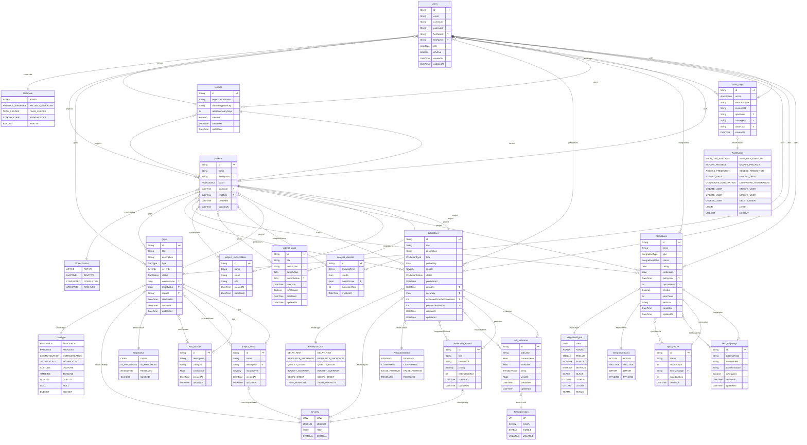

```mermaid
erDiagram

        UserRole {
            ADMIN ADMIN
PROJECT_MANAGER PROJECT_MANAGER
TEAM_LEADER TEAM_LEADER
STAKEHOLDER STAKEHOLDER
ANALYST ANALYST
        }
    


        ProjectStatus {
            ACTIVE ACTIVE
INACTIVE INACTIVE
COMPLETED COMPLETED
ARCHIVED ARCHIVED
        }
    


        GapType {
            RESOURCE RESOURCE
PROCESS PROCESS
COMMUNICATION COMMUNICATION
TECHNOLOGY TECHNOLOGY
CULTURE CULTURE
TIMELINE TIMELINE
QUALITY QUALITY
SKILL SKILL
BUDGET BUDGET
        }
    


        Severity {
            LOW LOW
MEDIUM MEDIUM
HIGH HIGH
CRITICAL CRITICAL
        }
    


        GapStatus {
            OPEN OPEN
IN_PROGRESS IN_PROGRESS
RESOLVED RESOLVED
CLOSED CLOSED
        }
    


        PredictionType {
            DELAY_RISK DELAY_RISK
RESOURCE_SHORTAGE RESOURCE_SHORTAGE
QUALITY_ISSUE QUALITY_ISSUE
BUDGET_OVERRUN BUDGET_OVERRUN
SCOPE_CREEP SCOPE_CREEP
TEAM_BURNOUT TEAM_BURNOUT
        }
    


        PredictionStatus {
            PENDING PENDING
CONFIRMED CONFIRMED
FALSE_POSITIVE FALSE_POSITIVE
RESOLVED RESOLVED
        }
    


        IntegrationType {
            JIRA JIRA
ASANA ASANA
TRELLO TRELLO
MONDAY MONDAY
BITRIX24 BITRIX24
SLACK SLACK
GITHUB GITHUB
GITLAB GITLAB
TEAMS TEAMS
        }
    


        IntegrationStatus {
            ACTIVE ACTIVE
INACTIVE INACTIVE
ERROR ERROR
SYNCING SYNCING
        }
    


        TrendDirection {
            UP UP
DOWN DOWN
STABLE STABLE
VOLATILE VOLATILE
        }
    


        AuditAction {
            VIEW_GAP_ANALYSIS VIEW_GAP_ANALYSIS
MODIFY_PROJECT MODIFY_PROJECT
ACCESS_PREDICTION ACCESS_PREDICTION
EXPORT_DATA EXPORT_DATA
CONFIGURE_INTEGRATION CONFIGURE_INTEGRATION
CREATE_USER CREATE_USER
UPDATE_USER UPDATE_USER
DELETE_USER DELETE_USER
LOGIN LOGIN
LOGOUT LOGOUT
        }
    
  "users" {
    String id "🗝️"
    String email 
    String username 
    String password 
    String firstName "❓"
    String lastName "❓"
    UserRole role 
    Boolean isActive 
    DateTime createdAt 
    DateTime updatedAt 
    }
  

  "projects" {
    String id "🗝️"
    String name 
    String description "❓"
    ProjectStatus status 
    DateTime startDate "❓"
    DateTime endDate "❓"
    DateTime createdAt 
    DateTime updatedAt 
    }
  

  "gaps" {
    String id "🗝️"
    String title 
    String description 
    GapType type 
    Severity severity 
    GapStatus status 
    Json currentValue "❓"
    Json targetValue "❓"
    String impact "❓"
    DateTime identifiedAt 
    DateTime createdAt 
    DateTime updatedAt 
    }
  

  "predictions" {
    String id "🗝️"
    String title 
    String description 
    PredictionType type 
    Float probability 
    Severity impact 
    PredictionStatus status 
    DateTime predictedAt 
    DateTime actualAt "❓"
    Float accuracy "❓"
    Int estimatedTimeToOccurrence "❓"
    Int preventionWindow "❓"
    DateTime createdAt 
    DateTime updatedAt 
    }
  

  "integrations" {
    String id "🗝️"
    String name 
    IntegrationType type 
    IntegrationStatus status 
    Json config 
    Json credentials 
    DateTime lastSyncAt "❓"
    Int syncInterval "❓"
    Boolean isActive 
    Int errorCount 
    String lastError "❓"
    DateTime createdAt 
    DateTime updatedAt 
    }
  

  "tenants" {
    String id "🗝️"
    String organizationName 
    String dataEncryptionKey 
    Int retentionPolicyDays 
    Boolean isActive 
    DateTime createdAt 
    DateTime updatedAt 
    }
  

  "project_stakeholders" {
    String id "🗝️"
    String name 
    String email 
    String role 
    DateTime createdAt 
    DateTime updatedAt 
    }
  

  "project_goals" {
    String id "🗝️"
    String title 
    String description "❓"
    Json targetValue 
    Json currentValue "❓"
    DateTime dueDate "❓"
    Boolean isAchieved 
    DateTime createdAt 
    DateTime updatedAt 
    }
  

  "analysis_records" {
    String id "🗝️"
    String analysisType 
    Json results 
    Float overallScore "❓"
    Int executionTime 
    DateTime createdAt 
    }
  

  "root_causes" {
    String id "🗝️"
    String description 
    String category 
    Float confidence 
    DateTime createdAt 
    DateTime updatedAt 
    }
  

  "project_areas" {
    String id "🗝️"
    String name 
    String description "❓"
    Severity impactLevel 
    DateTime createdAt 
    DateTime updatedAt 
    }
  

  "preventive_actions" {
    String id "🗝️"
    String title 
    String description 
    Severity priority 
    Int estimatedEffort 
    DateTime createdAt 
    DateTime updatedAt 
    }
  

  "risk_indicators" {
    String id "🗝️"
    String indicator 
    Float currentValue 
    Float threshold 
    TrendDirection trend 
    Float weight 
    DateTime createdAt 
    DateTime updatedAt 
    }
  

  "sync_results" {
    String id "🗝️"
    String status 
    Int recordsSync 
    String errorMessage "❓"
    Int syncDuration 
    DateTime createdAt 
    }
  

  "field_mappings" {
    String id "🗝️"
    String externalField 
    String internalField 
    String transformation "❓"
    Boolean isRequired 
    DateTime createdAt 
    DateTime updatedAt 
    }
  

  "audit_logs" {
    String id "🗝️"
    AuditAction action 
    String resourceType 
    String resourceId 
    String ipAddress "❓"
    String userAgent "❓"
    String dataHash "❓"
    DateTime createdAt 
    }
  
    "users" o|--|| "UserRole" : "enum:role"
    "users" o|--|| "tenants" : "tenant"
    "users" o{--}o "projects" : "projects"
    "users" o{--}o "gaps" : "gaps"
    "users" o{--}o "predictions" : "predictions"
    "users" o{--}o "integrations" : "integrations"
    "users" o{--}o "audit_logs" : "auditLogs"
    "projects" o|--|| "ProjectStatus" : "enum:status"
    "projects" o|--|| "users" : "user"
    "projects" o|--|| "tenants" : "tenant"
    "projects" o{--}o "gaps" : "gaps"
    "projects" o{--}o "predictions" : "predictions"
    "projects" o{--}o "integrations" : "integrations"
    "projects" o{--}o "project_stakeholders" : "stakeholders"
    "projects" o{--}o "project_goals" : "goals"
    "projects" o{--}o "analysis_records" : "analysisHistory"
    "gaps" o|--|| "GapType" : "enum:type"
    "gaps" o|--|| "Severity" : "enum:severity"
    "gaps" o|--|| "GapStatus" : "enum:status"
    "gaps" o|--|| "projects" : "project"
    "gaps" o|--|| "users" : "user"
    "gaps" o{--}o "root_causes" : "rootCauses"
    "gaps" o{--}o "project_areas" : "affectedAreas"
    "predictions" o|--|| "PredictionType" : "enum:type"
    "predictions" o|--|| "Severity" : "enum:impact"
    "predictions" o|--|| "PredictionStatus" : "enum:status"
    "predictions" o|--|| "projects" : "project"
    "predictions" o|--|| "users" : "user"
    "predictions" o{--}o "preventive_actions" : "suggestedActions"
    "predictions" o{--}o "risk_indicators" : "riskIndicators"
    "integrations" o|--|| "IntegrationType" : "enum:type"
    "integrations" o|--|| "IntegrationStatus" : "enum:status"
    "integrations" o|--|| "projects" : "project"
    "integrations" o|--|| "users" : "user"
    "integrations" o{--}o "sync_results" : "syncResults"
    "integrations" o{--}o "field_mappings" : "dataMapping"
    "tenants" o{--}o "users" : "users"
    "tenants" o{--}o "projects" : "projects"
    "project_stakeholders" o|--|| "projects" : "project"
    "project_goals" o|--|| "projects" : "project"
    "analysis_records" o|--|| "projects" : "project"
    "root_causes" o|--|| "gaps" : "gap"
    "project_areas" o|--|| "Severity" : "enum:impactLevel"
    "project_areas" o|--|| "gaps" : "gap"
    "preventive_actions" o|--|| "Severity" : "enum:priority"
    "preventive_actions" o|--|| "predictions" : "prediction"
    "risk_indicators" o|--|| "TrendDirection" : "enum:trend"
    "risk_indicators" o|--|| "predictions" : "prediction"
    "sync_results" o|--|| "integrations" : "integration"
    "field_mappings" o|--|| "integrations" : "integration"
    "audit_logs" o|--|| "AuditAction" : "enum:action"
    "audit_logs" o|--|| "users" : "user"
```
